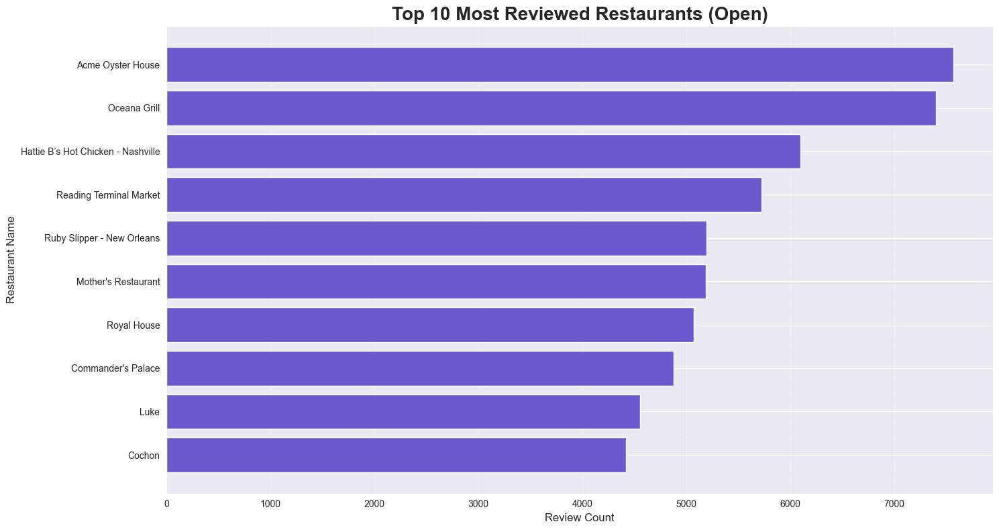
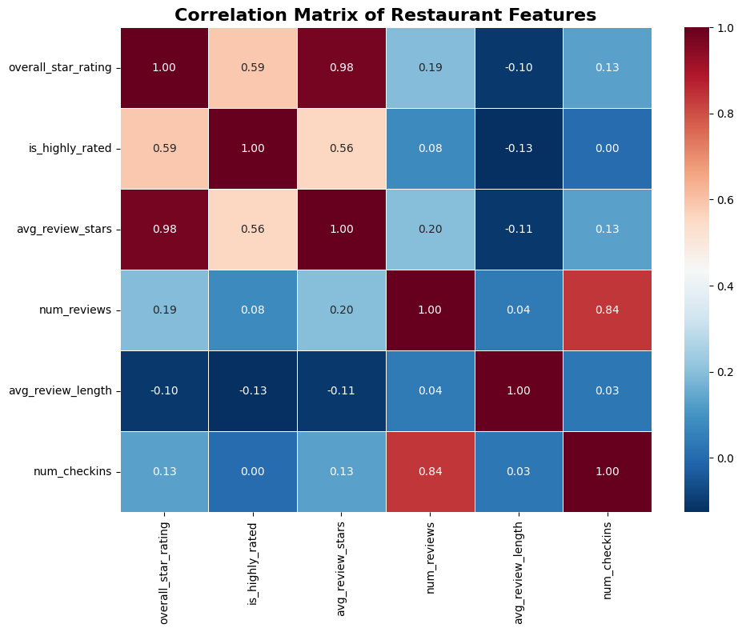
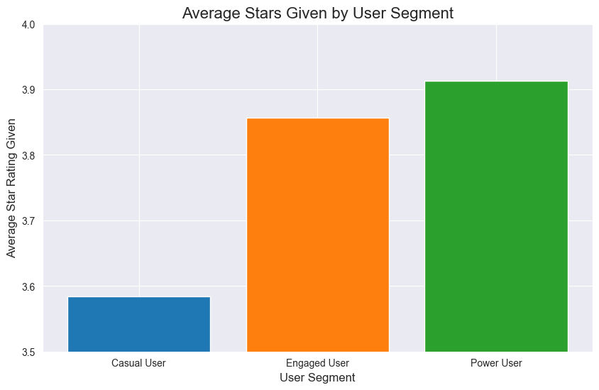
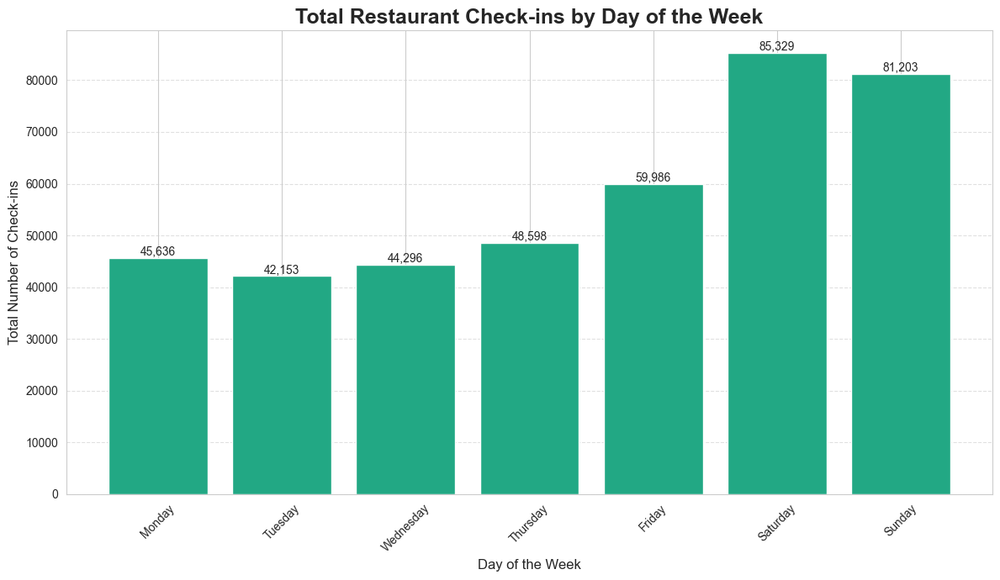
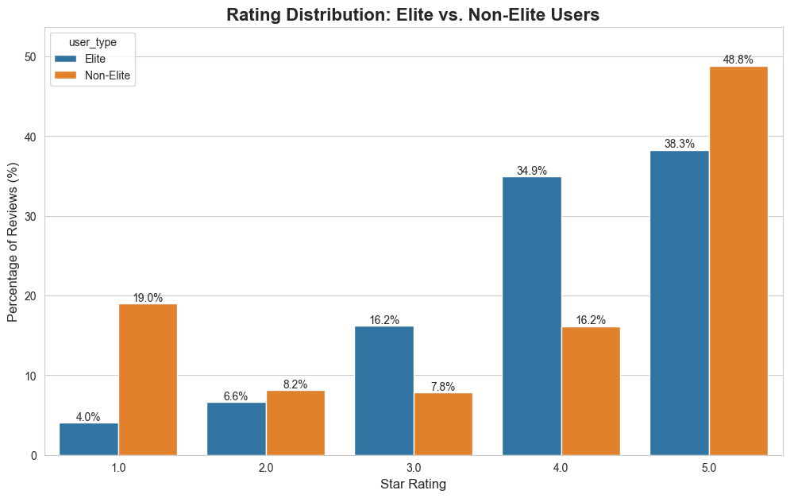

# Yelp Dataset Analysis: Key Findings and Insights

This report summarizes the major findings from the analysis of the Yelp Academic Dataset. The goal was to explore the characteristics of businesses, understand user behavior, and identify key trends that could inform business strategy. The analysis was conducted using SQL queries on a PostgreSQL database and visualized using Plotly.

## Table of Contents
1.  [Hypotheses](#1-hypotheses)
2.  [Key Findings and Visualizations](#2-key-findings-and-visualizations)
    - [Analysis 1: High-Level Business Statistics](#analysis-1-high-level-business-statistics)
    - [Analysis 2: Top 10 Most Reviewed Restaurants](#analysis-2-top-10-most-reviewed-restaurants)
    - [Analysis 3: Correlation of Features for Highly-Rated Restaurants](#analysis-3-correlation-of-features-for-highly-rated-restaurants)
    - [Analysis 4: Star Rating Behavior of Different User Segments](#analysis-4-rating-behavior-of-different-user-segments)
    - [Analysis 5: Distribution of User Segments](#analysis-5-distribution-of-user-segments)
    - [Analysis 6: City Market Opportunity Analysis](#analysis-6-city-market-opportunity-analysis)
    - [Analysis 7: Top Cities for Nightlife](#analysis-7-top-cities-for-nightlife)
    - [Analysis 8: Weekly Customer Traffic by Check-ins](#analysis-8-weekly-customer-traffic-by-check-ins)
    - [Analysis 9: Elite vs. Non-Elite User Rating Patterns](#analysis-9-elite-vs-non-elite-user-rating-patterns)
3.  [Limitations of the Analysis](#3-limitations-of-the-analysis)
4.  [Conclusion and Future Work](#4-conclusion-and-future-work)

---

### 1. Hypotheses

Before conducting the analysis, several hypotheses were formulated to guide the investigation:

*   **Hypothesis 1: Popularity vs. Quality:** A higher number of reviews will not be a strong predictor of a higher average star rating.
*   **Hypothesis 2: Experienced User Criticism:** More active and "Elite" users will be more critical and exhibit different rating patterns than casual users.
*   **Hypothesis 3: Weekend Peak:** Customer traffic, as measured by check-ins, will be significantly higher on weekends (Saturday and Sunday).
*   **Hypothesis 4: Market Saturation:** Cities with the most restaurants will not necessarily be the best markets for a new business.

---

### 2. Key Findings and Visualizations

This section details the results of each of the nine distinct analyses performed.

#### Analysis 1: High-Level Business Statistics

**Objective:** To get a baseline understanding of the dataset's scale.

**Finding:** The analysis shows that the average star rating across all businesses is **3.60**. The review counts vary dramatically, with some businesses having as few as 3 reviews and the most popular having over 7,500, indicating a wide distribution of business popularity.

#### Analysis 2: Top 10 Most Reviewed Restaurants

**Objective:** To identify the most popular, high-traffic businesses in the dataset.

**Finding:** A small number of American restaurants, primarily located in major cities, dominate the review landscape. This concentration highlights the strong brand recognition and high customer volume of market leaders.

#### Analysis 3: Correlation of Features for Highly-Rated Restaurants

**Objective:** To determine which business characteristics are most associated with a high rating (>4.0 stars).

**Finding:** A correlation matrix confirms **Hypothesis 1**. The `review_count` has a very weak correlation with a business being highly-rated. The strongest predictors are, logically, the `overall_star_rating` and the `avg_review_stars` from individual reviews.

#### Analysis 4: Stars Rating Behavior of Different User Segments

**Objective:** To see if a user's activity level impacts their rating behavior.

**Finding:** The data supports **Hypothesis 2**. "Power Users" (defined by high Stars and fan counts) give  higher average ratings than "Engaged User".

#### Analysis 5: Distribution of User Segments

**Objective:** To understand the composition of the Yelp user base.

**Finding:** The user base follows a power-law distribution. The vast majority of users are "Casual," with "Engaged" and "Power Users" making up a much smaller fraction. This provides context to the previous analysis, showing that while power users are more critical, they are also rare.

#### Analysis 6: City Market Opportunity Analysis

**Objective:** To identify the best cities to open a new restaurant based on market quality and engagement.

**Finding:** This analysis supports **Hypothesis 4**. The best markets are not necessarily the biggest. Cities like **Philadelphia**, which fall in the "sweet spot" of high average ratings and high average review counts, represent prime opportunities.

#### Analysis 7: Top Cities for Nightlife

**Objective:** To find the most prominent cities for the "Nightlife" category.

**Finding:** **Philadelphia** is the undisputed leader in the *quantity* of nightlife venues and customer *engagement*. However, other cities like Tampa and Indianapolis have higher average quality ratings.

#### Analysis 8: Weekly Customer Traffic by Check-ins

**Objective:** To determine the busiest days of the week for restaurants.

**Finding:** The data overwhelmingly supports **Hypothesis 3**. Customer check-ins peak dramatically on **Saturday and Sunday**, confirming the critical importance of weekdays business for restaurants.

#### Analysis 9: Elite vs. Non-Elite User Rating Patterns

**Objective:** To conduct a deeper dive into the rating behavior of Yelp's "Elite Squad."

**Finding:** This analysis provides further support for **Hypothesis 2**.
1.  **Rating Distribution:** Elite users are less likely to give extreme 1-star or 5-star reviews, preferring more nuanced 2, 3, and 4-star ratings.
2.  **Influence Over Time:** Contrary to what might be expected, the *proportion* of reviews from Elite users is not growing. It peaked around **2007** and has been on a gradual but steady decline ever since..

---

### 3. Limitations of the Analysis

-   **Data Timeliness:** The dataset is a periodic snapshot and does not represent real-time data.
-   **Geographic Bias:** The data is heavily focused on specific metropolitan areas in North America and Europe.
-   **Incomplete Data:** Some fields are not consistently populated, and some "orphan" records exist, requiring cleaning.
-   **Definition of "Success":** The analysis uses proxies like star ratings. True business success also involves financial metrics not present in the dataset.

---

### 4. Conclusion and Future Work

This project successfully validated our initial hypotheses and yielded key insights into the Yelp ecosystem. By systematically analyzing business attributes, user segments, market dynamics, and operational rhythms, we have painted a data-driven picture of the restaurant industry.

**Future Work could include:**
-   **Natural Language Processing (NLP):** Performing topic modeling on review text to identify specific drivers of reviews (e.g., "service," "ambiance," "price").
-   **Predictive Modeling:** Building a machine learning model to predict a restaurant's star rating.
-   **Geospatial Analysis:** Mapping restaurant "hotspots" and "deserts" within a city.