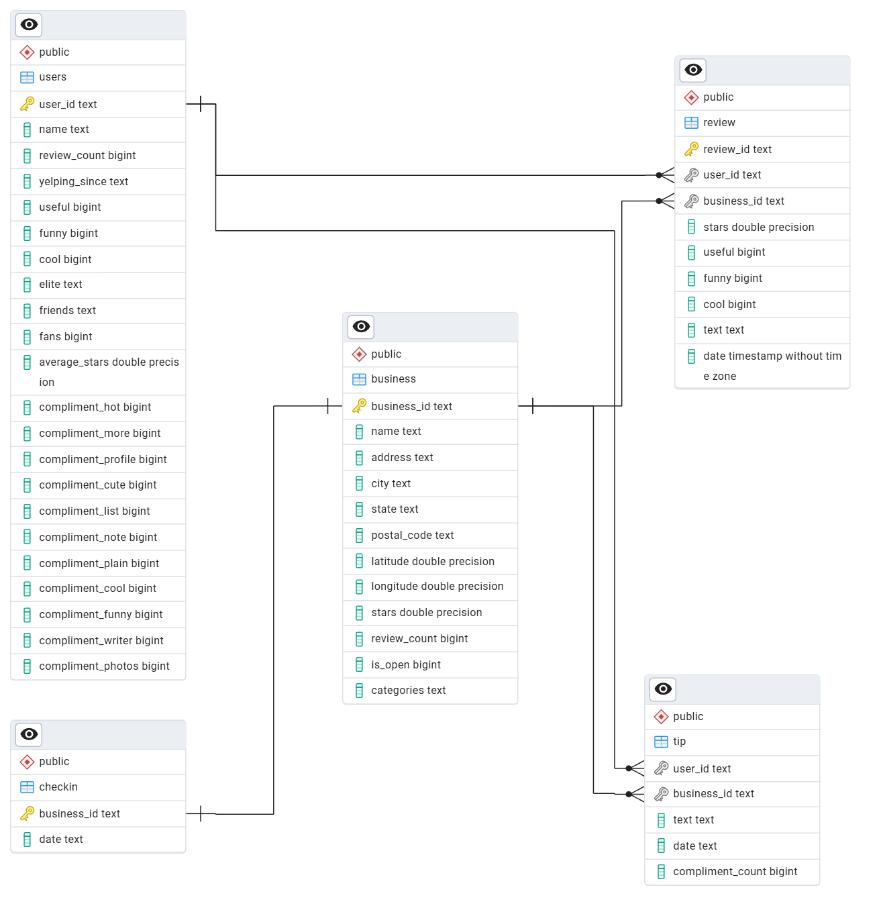

# Yelp Dataset ETL and Analysis Project

This project provides a comprehensive framework for performing an Extract, Transform, Load (ETL) process on the official Yelp Academic Dataset. Data is extracted from large JSON files, loaded into a PostgreSQL database, and then analyzed in-depth using a Jupyter Notebook. The analysis explores various business-centric questions and generates interactive visualizations with Plotly to uncover insights into restaurant trends and user behavior.

## Table of Contents

- [Project Overview](#project-overview)
- [Database Schema (ERD)](#database-schema-erd)
- [Technology Stack](#technology-stack)
- [Setup and Installation](#setup-and-installation)
- [Usage](#usage)
- [Project Structure](#project-structure)
- [Scope of Analysis](#scope-of-analysis)

## Project Overview

This project is divided into two main components:

1.  **ETL Pipeline (`etl_pipeline.py`)**: A robust Python script that handles the end-to-end process of reading the Yelp JSON files, performing basic data cleaning and transformation, and efficiently loading the data into a structured PostgreSQL database.

2.  **Data Analysis (`analysis.ipynb`)**: A Jupyter Notebook that serves as the analytical workbench. It connects to the populated database, executes SQL queries to aggregate and filter data, and uses the Plotly library to create a rich set of interactive visualizations to answer key business questions.

For a detailed report of the insights discovered during the analysis, please see the **[FINDINGS.md](FINDINGS.md)** file.

## Database Schema (ERD)

The ETL process creates five interconnected tables in the database. The relationships were established to enforce data integrity and allow for efficient `JOIN` operations.



## Technology Stack

- **Backend**: Python 3.8+
- **Database**: PostgreSQL
- **ETL & Data Manipulation**: Pandas, SQLAlchemy
- **Data Visualization**: Plotly
- **Interactive Environment**: Jupyter Notebook

## Setup and Installation

Follow these steps to set up the project environment on your local machine.

**Prerequisites:**
- Python 3.8 or higher
- A running PostgreSQL server
- Git

**Step 1: Clone the Repository**
```bash
git clone https://github.com/your-username/yelp-dataset-analysis.git
cd yelp-dataset-analysis
```

**Step 2: Set Up a Python Virtual Environment**
It is highly recommended to use a virtual environment to manage project dependencies.
```bash
# Create the environment
python -m venv yelp_venv

# Activate the environment
# On macOS/Linux:
source yelp_venv/bin/activate
# On Windows:
.\yelp_venv\Scripts\activate
```

**Step 3: Install Required Packages**
Install all necessary libraries from the [requirements.txt](requirement.txt) file.
```bash
pip install -r requirements.txt
```

**Step 4: Download the Yelp Dataset**
This project uses the official Yelp Academic Dataset. **The raw JSON files are not included in this repository due to their large size.**

1.  Download the dataset from the [**Yelp Open Dataset website**](https://www.yelp.com/dataset).
2.  Extract the downloaded archive.
3.  Place all the `yelp_academic_dataset_*.json` files inside the `dataset/` directory in the project's root.

**Step 5: Configure the Database Connection**
1.  In your PostgreSQL instance, create a new database (e.g., `yelp_db`).
2.  In the project directory, **rename `config_template.py` to `config.py`**.
3.  Open the `config.py` file and fill in your PostgreSQL credentials (`DB_USER`, `DB_PASSWORD`, `DB_HOST`, `DB_PORT`, `DB_NAME`) and the absolute path to the project's root directory (`BASE_DIR`).

## Usage

Once the setup is complete, you can run the project.

**1. Run the ETL Pipeline**
Execute this script from your terminal to populate your PostgreSQL database. This may take several minutes depending on your machine's performance.
```bash
python etl_pipeline.py
```

**2. Launch the Analysis Notebook**
Start JupyterLab to begin the interactive analysis.
```bash
jupyter-lab
```
- From the JupyterLab interface, open the `analysis.ipynb` notebook.
- Run the cells sequentially to execute the SQL queries, perform the analysis, and generate the visualizations.

## Project Structure

```
.
├── dataset/              # Directory for raw Yelp JSON files (not tracked by Git)
├── screenshots/          # Contains ERD and visualization images
│   ├── erd.png
│   └── ...
├── .gitignore
├── analysis.ipynb        # Jupyter Notebook for data analysis
├── config.py             # Local DB configuration (ignored by Git)
├── config_template.py    # Template for config file
├── etl_pipeline.py       # Main ETL script
├── FINDINGS.md           # Detailed report of analytical findings
├── README.md             # This file
├── requirements.txt      # Python package dependencies
└── yelp_etl.log          # Log file for the ETL process
```

## Scope of Analysis

A comprehensive analysis was performed to answer a wide range of questions about the Yelp ecosystem. Key analyses include:

-   **High-Level Business Statistics:** Calculating baseline metrics for the entire business dataset.
-   **Top 10 Most Reviewed Restaurants:** Identifying market leaders based on popularity.
-   **Predictors of High Ratings:** A correlation analysis to determine which features are most associated with a highly-rated restaurant.
-   **User Segmentation:** Comparing the rating behavior and distribution of "Casual," "Power," and "Elite" user segments.
-   **Market Opportunity Analysis:** A geographic analysis to identify cities with the best balance of market quality and customer engagement.
-   **Nightlife Hotspot Identification:** Finding the top cities for nightlife by venue count and quality.
-   **Weekly Customer Traffic:** Analyzing check-in data to determine the busiest days of the week for restaurants.
-   **Elite User Deep Dive:** A detailed look at the rating patterns of Yelp's Elite Squad and their growing influence over time.

For a full breakdown of each analysis with visualizations and insights, please read the detailed **[FINDINGS.md](FINDINGS.md)** report.